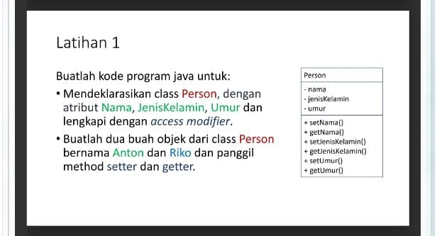

# PBO-TUGAS3

## Nama : Raul Putra Widodo NIM : 312310610 Kelas : TI.23.A.6

## SOAL

## Kode Program Java
// Deklarasi class Person
class Person {
    // Atribut dengan access modifier private
    private String nama;
    private String jenisKelamin;
    private int umur;
    
    // Setter dan Getter untuk nama
    public void setNama(String nama) {
        this.nama = nama;
    }
    
    public String getNama() {
        return this.nama;
    }
    
    // Setter dan Getter untuk jenisKelamin
    public void setJenisKelamin(String jenisKelamin) {
        this.jenisKelamin = jenisKelamin;
    }
    
    public String getJenisKelamin() {
        return this.jenisKelamin;
    }
    
    // Setter dan Getter untuk umur
    public void setUmur(int umur) {
        this.umur = umur;
    }
    
    public int getUmur() {
        return this.umur;
    }
}

// Main class untuk eksekusi
public class Main {
    public static void main(String[] args) {
        // Membuat dua objek dari class Person
        Person anton = new Person();
        Person riko = new Person();
        
        // Set data untuk Anton
        anton.setNama("Anton");
        anton.setJenisKelamin("Laki-laki");
        anton.setUmur(25);
        
        // Set data untuk Riko
        riko.setNama("Riko");
        riko.setJenisKelamin("Laki-laki");
        riko.setUmur(23);
        
        // Menampilkan informasi Anton
        System.out.println("Data Anton:");
        System.out.println("Nama: " + anton.getNama());
        System.out.println("Jenis Kelamin: " + anton.getJenisKelamin());
        System.out.println("Umur: " + anton.getUmur());
        
        // Menampilkan informasi Riko
        System.out.println("\nData Riko:");
        System.out.println("Nama: " + riko.getNama());
        System.out.println("Jenis Kelamin: " + riko.getJenisKelamin());
        System.out.println("Umur: " + riko.getUmur());
    }
}
# Output

  # Penjelasan
